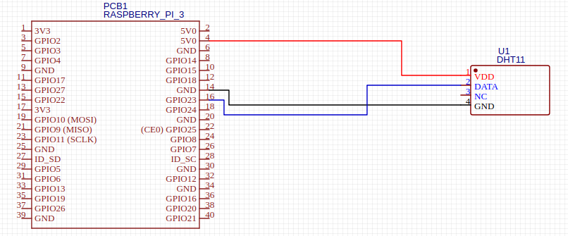

# DHT11-Raspberry pi model B+
### Sensor de temperatura y humedad con raspberry
## INSTRUCCIONES
### CONEXIÓN DEL SENSOR A RASPBERRY

| Pin en el DHT11 | Pin Raspberry |
| -- | -- |
| GND | 14 |
| VCC | 4 |
| NC | No se conecta |
| DATA | 16 |

Nota: Esto podría cambiar dependiendo de tu modelo de Raspberry.

#### Diagrama esquematico de conexiones 

### INSTALACIÓN DE BIBLIOTECAS Y MODULOS QUE SE UTILIZAN
* Nos aseguramos de tener todos los repositorios actualizados, incluyendo pip :

    `sudo apt-get update
    sudo apt-get install python3-pip
    sudo python3 -m pip install --upgrade pip setuptools wheel`

  
* Instalamos con la instrucción pip3:

  `sudo pip3 install Adafruit_DHT`
  
* Clonamos el repositorio:

`git clone https://github.com/adafruit/Adafruit_Python_DHT.git`

* Compilamos e instalamos desde el repositorio :

  `cd Adafruit_python_DHT
  sudo python3 setup.py install`

* Instalamos el modulo paho de Python que es el que nos permitirá realizar la conexión MQTT:

  `pip3 install paho-mqtt` 
      
  en caso de que no lo permita, usamos `sudo` antes de la instrucción.
  
* Ahora vamos a probar un código, escribimos lo siguiente en la terminal:

 `cd Documents` 

 `git clone https://github.com/ElierRosales/Capstone-project-Administrador-de-laboratorios.git`
 
  entramos en la carpeta DHT11 la cual encontraremos dentro de nuestra carpeta Documents, abrimos el archivo temperatura.py
  con Thony Python IDE y damos en el botón Run.
  Nuestro sensor imprimira y mandará las mediciones de temperatura y humedad cada 5 segundos al tema al que configuramos.
