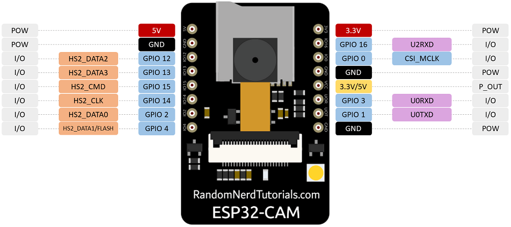
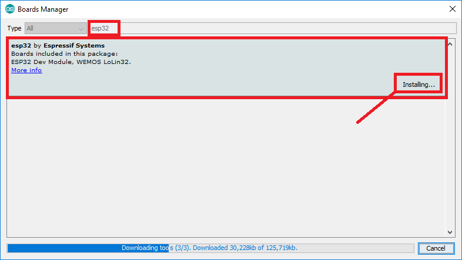
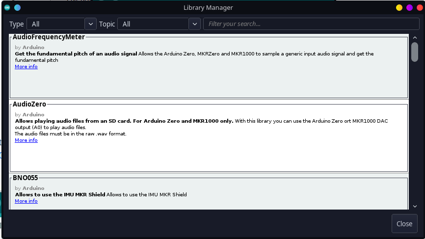

# **LECTOR DE SINTOMAS COVID EN ESP32CAM-AITHINKER**
## **Descripción**
Este programa realiza una medición de signos vitales (Pulso cardiaco/Oxigenación), para posteriormente enviar los valores mediante MQTT a un tema monitoreado en Node-Red.
## **Materiales**
- ESP32-CAM
- MAX3010x (en este caso Max30102)
- FTDI/Modulo programador
- Conexión WiFi a internet o a una Red Local.
- Broker MQTT (Público o Privado)
## **Instrucciones** ##
## **CONEXIONES EN HARDWARE** ##
### Primero tenemos que asegurarnos de realizar las conexiones del circuito correctamente, como se muestra a continuación:
  - 5V = 5V (3.3V también funciona)
  - GND = GND
  - SDA = GPIO15
  - SCL = GPIO14
  - INT = No se conecta.
  - LED ROJO = GPIO12
  - LED AZUL = GPIO13
  - LED VERDE = GPIO2
  - Boton = GPIO4
### RECORDEMOS QUE LOS COLORES SON INDIFERENTES.
Siguiendo el siguiente de mapeo de pines:
- ESP32CAM/AI-THINKER
- MAX30102

  
## FTDI 
Para poder programar nuestro ESP32CAM se necesita un modulo programador, en este caso se utilizó un FTDI con las siguientes conexiones para subir el código:

- Modulo programador FTDI

## SOFTWARE NECESARIO ##
Se utilizó arduino IDE para el manejo de bibliotecas y la edición del código fuente.

Arduino IDE está disponible para Windows/Linux y MacOS en el siguiente enlace:
- https://www.arduino.cc/en/software

## Instalación del soporte para ESP32CAM en Arduino IDE. ##
- Abrir el Arduino IDE, hacer click en File > Preferences 
  
  
- Ingresa la siguiente URL `https://dl.espressif.com/dl/package_esp32_index.json` en el campo llamado "Aditional Board Manager URLs mostrado abajo. Despúes presiona OK.
- Abrir el administrador de tarjetas o Board Manager. 
- Dentro del board manager buscar 'ESP32' y presionar "Install" en la opción "ESP32 by Espresif Systems".
## Comprobar la instalación ##
- Selecciona tu tarjeta en Tools > Board, en mi caso AI-THINKER ESP32-CAM. 
- Si no aparece este modelo, es probable que no hayas instalado el soporte de manera correcta, debes reintentarlo.
## Instalar biblioteca necesaria para el manejo del MAX3015
- Abrir el administrador de bibliotecas del Arduino IDE, Tools > Manage Libraries. 
- En el buscador de librerias, buscar "MAX30105" e instalar la siguiente: 
## Instalar biblioteca para el manejo de funciones MQTT.
- En el mismo administrador de bibliotecas, buscar e instalar la siguiente librería: 
## Boton
Para sincronizar la lectura de ambos sensores (MLX90614 y MAX30102), compartiran un push button, conectado a GPIO4 en el caso del ESP32CAM y tambien conectado a GPIO22 en la raspberry.

Para agregar el boton, consideraremos el siguiente ejemplo:

Donde vamos a omitir la parte del LED y nos centraremos exclusivamente en el boton, el cable azul tendria que ir al GPIO4 de nuestra ESP32 y sobre esa misma linea, iria otro cable al GPIO22 de nuestra raspberry pi.

Todo esto con el fin de que al presionar el boton se mande una señal a ambos dispositivos disparando el modo lectura de ambos sensores.
## LED's
El sistema implementa 3 leds ante la falta de una pantalla, con los cuales se realiza la comunicacion con el usuario.

|LED|FUNCION|
|---|-------|
|Rojo|Led de energia/encendido|
|Azul|Led de status wifi|
|Verde|Led MQTT|

El led rojo se encendera una vez que el dispositivo reciba energia, mientras que el led azul se encendera cuando se conecte a la red wifi designada en el codigo, y no se encendera cuando no se pueda conectar a la red, el led verde se encendera cuando se haga conexion con el broker y parpadeara con cada envio de datos.

En caso de que el led rojo parpadee, significa que el envio mqtt fallo por alguna razon.
## Modos
El sistema cuenta con 2 modos, un modo standby y un modo de lectura.
- Standby
  
  
- Lectura
  
  
### Ahora solo queda programar el ESP32-CAM con el código de este repositorio.
# Errores comunes
## El sistema solo enciende el led de energia.
Este error sucede la mayoria de veces a causa de un Brownout(Falta de voltaje) es decir que el microcontrolador no esta recibiendo el voltaje necesario, por lo tanto se reinicia indefinidamente.

Para solucionarlo hay que revisar el cableado y la fuente de alimentacion, muchas veces un cable de mala calidad puede provocar que el dispositivo no reciba suficiente energia.