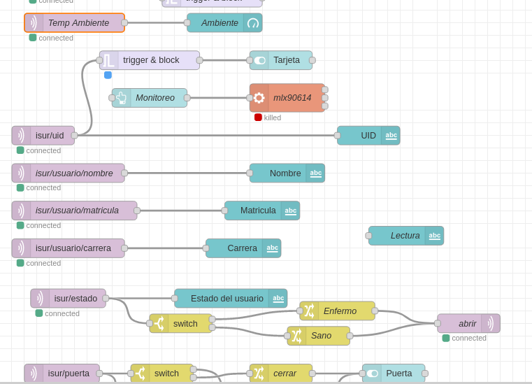
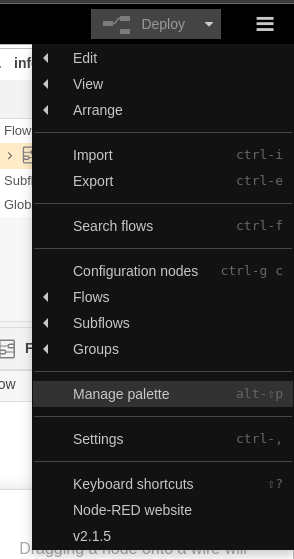
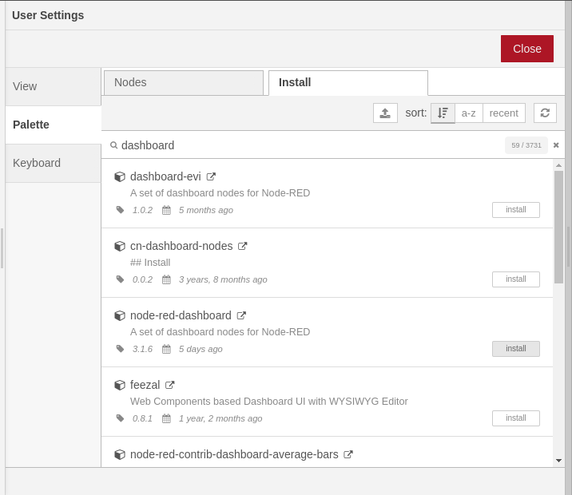
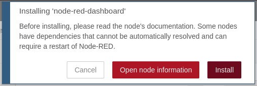
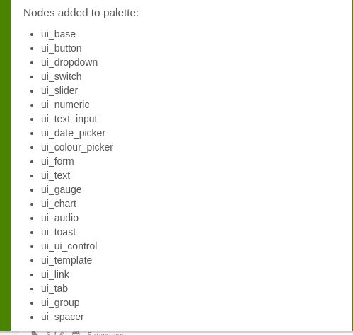

# Centro de control de acceso en Node-red.

## Descripcion
'Flow' de node red para el control de acceso, que administra el ingreso de usuarios que NO cuenten con sintomas de COVID-19 y que no permite el paso a aquellos que cuenten con los sintomas.

## Materiales
- Raspberry Pi
- NodeJS
- NPM
- Conexion a internet/Red local
- Broker MQTT(publico o privado)
## Instalar Node-red en Raspberry Pi
De acuerdo a la pagina oficial de Node-red, para instalar Node-red, crearon un script que instala Node.js,npm y Node-red simultaneamente, ejecutando el siguiente bash script:

`bash <(curl -sL https://raw.githubusercontent.com/node-red/linux-installers/master/deb/update-nodejs-and-nodered)`

Este script deberia funcionar en cualquier distribucion basada en Debian, de cualquier manera, asegurate de tener instalado el siguiente paquete mediante el siguiente comando:

`sudo apt install build-essential git curl`

## Iniciar Node-red

Para iniciar el servicio de Node-red, basta con escribir en la terminal el siguiente comando:

`node-red`

Esto iniciara un servicio web alojado localmente en el puerto 1880, asi que lo unico que necesitas hacer para comenzar a 'programar' en node red, es abrir un navegador y escribir en la barra de direcciones:

`localhost:1880`

La raspberry pi cuenta con recursos muy limitados, y utilizar directamente node-red podria no ser una experiencia fluida, por lo tanto, lo mejor es iniciar el servicio en la raspberry, y visitarlo desde un navegador alojado en tu computadora principal, para hacer esto, necesitamos conocer la ip de nuestra raspberry, e ingresarla de la siguiente manera:

Asumiendo que la ip local de nuestra raspberry es 192.169.1.29 debemos ingresar lo siguiente en la barra de direcciones:

`192.169.1.29:1880`
## Modulos utilizados
- node-red-dashboard
- node-red
## Instalando Modulos en Node-red.
Para instalar nuevos Modulos en nuestro Node-red, seguiremos los siguientes pasos:

- Dirigete al boton en la esquina superior derecha y selecciona 'Manage Palette'
  
  
- Después se abrirá un menú, nos dirigimos a "Install" y escribimos 'Dashboard'. Seleccionamos 'node-red-dashboard' y presionamos el botón de instalar como se ve a continuación:
  
  
- Ahora nos pedirá una confirmación de si queremos instalar el módulo, seleccionaremos 'Install' y esperaremos a que se lleve a cabo la instalación.
  
  
- Finalmente nos aparecerá el siguiente pop-up confirmando los 'nodos' que fueron agregados.
  
  
## Dependencias
Este flow de Node-red depende de los modulos antes mencionados, ademas de los siguientes programas:

- Lector de temperatura infrarrojo MLX90614, disponible en el siguiente enlace: [MLX90614](https://github.com/ElierRosales/Capstone-project-Administrador-de-laboratorios/tree/main/MLX90614)
- Lector de sintomas covid con el MAX30102, disponible en el siguiente enlace: [MAX30102](https://github.com/ElierRosales/Capstone-project-Administrador-de-laboratorios/tree/main/MAX30102)
- Lector de temperatura y humedad con el DHT11, disponible en el siguiente enlace: [DHT11](https://github.com/ElierRosales/Capstone-project-Administrador-de-laboratorios/tree/main/DHT11)
- buscarUID.py para administrar los datos en MongoDB, disponible en el siguiente enlace: [MongoDB](https://github.com/ElierRosales/Capstone-project-Administrador-de-laboratorios/tree/main/MongoDB)
## Modo de uso
Una vez cargado el json con la informacion de los nodos, y con las dependencias satisfechas, obtendremos un dashboard como el siguiente:

Dentro de este dashboard, tenemos 5 secciones divididas, las cuales explicare a continuacion.

- Salon
  
  Esta seccion esta meramente dedicada a mostrar las condiciones del salon/laboratorio a monitorizar, tenemos la temperatura ambiente, reportada por el MLX90614 en conjunto con el DHT11, que a su vez tambien reporta el porcentaje de humedad.
- Control
  
  Esta seccion nos muestra el boton de inicio de monitoreo, este boton solo tiene que ser presionado una vez cada que se inicia el servicio, la funcion de este boton es ejecutar el script en python del sensor MLX90614 mostrado anteriormente, esto debido a que este script no puede ser ejecutado en cada inicio de la raspberry. Una vez presionado el boton, el sensor MLX90614 y el MAX30102, ambos dedicados a realizar la lectura de sintomas, entraran en un modo standby, en espera de un usuario.

  Dado que los sensores necesitan que coloques al menos un dedo en cada superficie, debes presionar el boton fisico que sincroniza la lectura de ambos sensores por 3 segundos, posteriormente tienes 2 segundos para poner algun dedo en cada sensor y esperar a que la lectura termine. Para ayudar al usuario a saber en que estado se encuentra alguno de los sensores (standby/lectura), cada sensor tiene una secuencia de leds que nos ayuda a indicar lo mismo, como veremos a continuacion:
  
  - MAX30102+ESP32CAM(STANDBY)

    
  - MAX30102+ESP32CAM(LECTURA)
    
    

  - MLX90614+RASPBERRYPI(STANDBY)
    
    

  - MLX90614+RASPBERRYPI(LECTURA)
  
    
  
  Por lo tanto, una secuencia estatica en los leds significa lectura, mientras que una secuencia dinamica significa standby. Los sensores estan programados para realizar una lectura y publicarla mediante MQTT.

  A su vez, esta seccion nos proporciona informacion sobre si fue detectada una tarjeta, el estado de la puerta y la oportunidad de abrir la puerta de manera manual, esto debido a que el sistema esta programado para solamente abrir la puerta en caso de que los sintomas del usuario nos confirmen que esta sano, en caso de tener al menos un sintoma de enfermedad, la puerta no se abrira. 

  En dado caso que el sistema sufra algun daño, funcionamiento inesperado o simplemente se necesite cerrar o abrir la puerta manualmente, se habilito el switch de apertura manual.
- Signos vitales
  
  En esta seccion, se muestran las lecturas que nos envian los sensores, pulso cardiaco, oxigenacion y temperatura corporal.
- Lectura de sintomas.
  
  En esta seccion simplemente se muestra el estado de la lectura de sintomas, es decir, cuando se recibe un mensaje en los temas mqtt de cada signo vital se activa el switch respectivamente. 

  Si un switch no se activa durante la lectura, significa que hubo un error en el proceso y que al menos no se recibio mediante mqtt algun valor, lo cual puede servirnos para encontrar los problemas en caso de mal funcionamiento.
- Usuario
  
  En esta seccion, mostramos los datos almacenados en la base de datos acerca del usuario al que le pertenece el UID(El numero de identificacion unico de cada tarjeta rfid), node-red detecta el uid en el tema mqtt correspondiente, y el programa **buscarUID.py** mencionado anteriormente busca en la base de datos los datos asociados a esa tarjeta, para enviarlos por mqtt nuevamente hacia node-red, y mostrarlos en pantalla.

  Tambien se registra la hora de entrada y salida.
